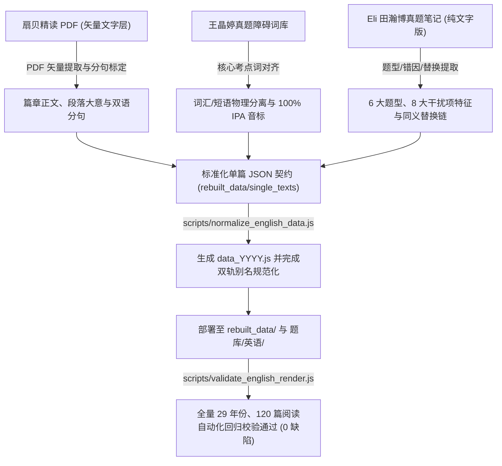

# 考研智能题库与复习工作台 (Kaoyan Question Bank)

> 专为研究生入学考试（考研数学 · 822 控制工程基础 · 考研英语真题精读）深度定制的**高性能、沉浸式、全功能本地刷题与间隔复习工作台**。

---

## 🌟 核心设计理念与特色

- ⚡ **全键盘优先操作 (Keyboard-First)**：全套快捷键覆盖切题、评级、看解析、记笔记、查生词，实现 60 FPS 瞬时切换无卡顿。
- 📚 **多学科统一架构 (Multi-Subject Architecture)**：考研数学（高数/线代/概率论 200+ 章节全覆盖）、822 控制工程基础、考研英语一真题（1998~2026 全年份）全模块无缝集成。
- 📖 **考研英语智能精读与双轨引擎 (English Dual-Engine)**：支持「纯净真题模考」与「深度分句精读」一键切换；集成 696 处长难句语法精析、双轨真人原声发音、考点生词本与王晶婷 6 大题型/8 大干扰项错因剖析。
- 🧠 **SM-2 间隔重复复习引擎 (Spaced Repetition)**：基于遗忘曲线与记忆留存率算法，自动规划复习计划，支持自定义冲刺与会话断点续接。
- 🔗 **跨书同类题与考点工作台 (Related Questions & Topics)**：支持跨书考点归档、单列大图对比、折叠解析与多级跳转返回栈（跳转自动平滑置顶）。
- 📝 **Markdown + KaTeX 专业公式笔记**：支持行内与独立 LaTeX 公式实时渲染，具备公式自适应行高与数学符号输入面板。
- 🎨 **原图高亮标注 (Canvas Marker)**：内置矢量画板，支持对题目图片与解析图进行画线、线框标记与持久化回显。
- 💾 **无损本地数据库双向同步 (Zero-Loss Storage Sync)**：实时双向联动 `localStorage` 与本地 `kaoyan_tiku_data.json`，支持历史数据全自动平滑迁移。

---

## 📋 模块功能一览

### 1. 多学科题库支持
| 科目代码 | 科目名称 | 涵盖教材 / 习题册 / 真题集 | 特色支持 |
| :---: | :---: | :--- | :--- |
| `math` | **考研数学** | 《基础30讲》《强化36讲》《1000题》《李范全书》《李范习题》《夜雨强化》《老姚高数》 | 支持 1000 题伴章合并、小题模式（`F` 键）、分区手风琴 |
| `822` | **控制工程基础** | 《822 教材》《小题300》《强化240》《真题分类》 | 按题型与大题分类排布，支持多问子题折叠导航 |
| `english` | **考研英语一** | 1998 ~ 2026 历年考研英语一全真阅读题面与深度解析（共 120 篇阅读、580 道试题） | 分屏双语阅读器、长难句语法树、双轨发音词典、干扰项特征标注 |

---

### 2. 考研英语智能精读与题型分析系统

#### ① 纯净模考与沉浸精读双轨引擎
- **模考做题模式 (`Practice Mode`)**：隐藏全篇译文、语法拆解与题目解析，支持全键盘（`A`/`B`/`C`/`D` 与 `Enter` 提交）作答。交卷后自动对照官方答案、记录掌握度评级并高亮原文定位依据。
- **沉浸精读模式 (`Analysis Mode`)**：支持单句点按展开双语对照、全文译文一键开启、句内考点词三色标注与一键双向题文互寻。

#### ② 696 处长难句语法精析卡片
- 针对真题中的复合从句、虚拟语气、倒装引述、并列伴随等复杂语法现象，在译文下方以**紫色微质感卡片 (`.sentence-syntax`)** 同步呈现结构化剖析：
  - **【句型】** 明确主从复合句、条件从句、并列倒装等结构类型；
  - **【主干】** 提取主谓宾 / 主系表核心骨架；
  - **【修饰从句】** 拆解定语从句、状语从句、同位语从句与非谓语短语；
  - **【核心句型】** 标注固定句式搭配（如 `it involves doing... rather than...`）。

#### ③ 双轨高保真真人发音与智能生词本
- **双轨发音**：优先调用有道高保真英国/美国真人原声；在弱网/离线环境下无缝降级为浏览器原生 Edge 神经网络语音合成。
- **即时词卡与锁定**：鼠标划过词汇即时弹出音标、词性与真题语境释义；点击词汇可常驻锁定词卡。
- **本地词库同步**：点击收藏按钮将生词实时归入当前年份词库，支持生词本模态框集中浏览、遮词自测（模糊模式）与 JSON 备份导出。

#### ④ 王晶婷 6 大标准题型与 8 大干扰项特征剖析
- **6 大标准题型**：细节题、推断题、例证题、主旨题、态度题、词义题，支持顶部工具栏一键分类筛选。
- **8 大干扰项特征深度归因**：
  1. `UNFOUNDED` (无中生有)
  2. `ATTRIBUTION_ERROR` (张冠李戴)
  3. `EXTREME_ABSOLUTE` (夸大/绝对化)
  4. `CONTRADICTION` (正反混淆/与原文矛盾)
  5. `CAUSALITY_INVERSION` (因果倒置)
  6. `SCOPE_DISTORTION` (以偏概全/范围缩扩)
  7. `CONCEPT_DISTORTION` (偷换概念)
  8. `LITERAL_TRAP` (字面陷阱/望文生义)
- **正确项定位与同义替换**：明确标定正确项在原文中的证据句编号（如 `[P2-S3]`）与核心词汇/短语的同义替换映射链。

#### ⑤ 错因复盘手记与唐迟方法论
- 提供错因归因快捷标签（定位偏差、生词卡壳、逻辑倒置、过度推理、偷换概念、粗心看漏）；
- 内置 Markdown 复盘笔记本，按题号和年份自动持久化存储思考轨迹；
- 整合「唐迟阅读逻辑法则」（细节服从主旨、反向推导、首末句定位）与「命题人避坑指南」。

---

### 3. 跨书同类题与考点归纳 (数学与控制)
- **考点主题库**：一键为任意题目添加/归属考点标签（如“泰勒展开与极值”、“矩阵的秩”）；
- **跨书查题浏览器**：上方 1:1 对称等宽工作台，支持书籍/学科/章节三级下拉与 5 列网格无缝跳题；
- **竖向大图流对比**：下方清晰呈现同类题目的题干原图与可折叠解析图，支持题干与解析一键放大；
- **智能跳转返回栈**：点击「跳转做此题」后**页面自动平滑置顶**，完成做题后可一键「返回原题」。

---

### 4. 右侧题号区智能徽章系统
题号按钮右上角配备高辨识度状态提示点，状态一目了然：
- 🟡 **亮黄圆点（`●`）**：该题包含个人笔记（`.note-dot`）；
- 🔵 **亮蓝圆点（`●`）**：该题包含原图涂鸦/线框标注（`.annot-dot`）；
- 🟣 **品红圆点（`●` `#ff007f`）**：该题已归入考点主题库（同类题关联，`.related-dot`）；
- 🔴 **Q / S / 书**：标记题目图片问题（`Q`）、解析图片问题（`S`）或与实书排版不符（`书`）。

---

## 🏛️ 考研英语真题题库架构与精读重构流程

### 1. 核心资源文件夹映射一览

```text
考研题库/
├── 题库/英语/                      # [线上生产源] 前端应用直接运行加载的数据集
│   ├── data_1998.js ~ data_2026.js # 全年份真题 JS 文件 (window.ENGLISH_DATA[YYYY])
│   └── ...                         # 包含 120 篇阅读、580 道试题与 696 处长难句分析
│
├── rebuilt_data/                   # [精读重构母库] 2007~2015 黄金十年高精度重构源码库
│   ├── single_texts/               # 36 篇独立阅读单篇标准化 JSON 契约文件
│   │   ├── text_2007_t1.json ~ text_2007_t4.json
│   │   ├── ...
│   │   └── text_2015_t1.json ~ text_2015_t4.json
│   ├── data_2007_rebuilt.json ~ data_2015_rebuilt.json # 每年份 4 篇合并的重构 JSON
│   └── data_2007.js ~ data_2015.js # 编译出的规范化 JS 生产镜像
│
├── scripts/                        # [工程工具链] 校验、归一化与测试自动化脚本
│   ├── normalize_english_data.js   # 题库弹性归一化与双向同步脚本
│   └── validate_english_render.js  # 29 年全库自动化回归测试套件 (0 缺陷把关)
│
└── d:\tj\822\英一\                 # [外部权威语料源] 原始官方真题与名师语料库映射
    ├── 历年真题/                   # 教育部考试中心历年官方原版真题试卷与答案
    ├── 精读/                       # 扇贝精读矢量文字层 PDF (用于无损抽取分句与译文)
    ├── 词汇/                       # 王晶婷真题障碍词库 (用于对齐核心考点词)
    └── 笔记/                       # 《Eli田瀚博真题笔记》纯文字版 (用于对齐同义替换与干扰项)
```

---

### 2. 扇贝 / 晶婷 / 田瀚博三位一体免扫描重构流水线

传统题库构建多依赖黄皮书或讲义的扫描件 OCR，存在易乱码、音标丢失、版面断裂等问题。本项目采用全新的**免扫描全矢量精读重构流水线**：



#### 流水线核心原则与质量红线：
1. **词汇与短语物理拆解**：
   - 彻底将单词（`vocabulary`）与固定词组搭配（`phrasesAndCollocations`）独立分离，不混杂在单行释义中；
   - 单词必须包含 `word`, `ipa`, `pos`, `location`, `contextMeaning`, `examMeaning`, `frequencyRating`。
2. **零音标缺失保障 (100% IPA Coverage)**：
   - 严格杜绝旧库中的空音标与字形乱码，所有生词均搭载标准国际音标（IPA）并支持真人发音。
3. **分句与段落绝对自洽**：
   - 句子编号严格按 `P{段落号}-S{句号}` 规则规范化，保证原题定位与高亮跳转 100% 准确定位，绝无 DOM 冲突。
4. **前端韧性双轨兼容 (Dual-Layer Normalization)**：
   - 前端应用在 `js/english_app.js` 中内嵌 `normalizeText` 归一化层，向下兼容旧版字段（`paragraphs`, `stem`, `type`），向上兼容重构层结构（`textAnalysis.paragraphs`, `syntaxAnalysis`, `standardType`, `questionText`），确保任何年份、任何数据源均可流畅无缝加载。

---

### 3. 自动化质量审计与回归工具链

项目配备了高可靠性的自动化质量审计脚本，作为每次数据更新发布的前置把关红线：

```bash
# 1. 对 2007~2015 年重构数据执行规范化与双向对齐同步
node scripts/normalize_english_data.js

# 2. 检查全部题库文件语法有效性
node -e "for (let y = 1998; y <= 2026; y++) require('child_process').execSync('node -c 题库/英语/data_' + y + '.js'); console.log('All JS syntax valid!');"

# 3. 运行 1998~2026 全库自动化回归测试 (验证篇章、段落、句子、长难句、题目与选项契约)
node scripts/validate_english_render.js
```

**最新自动化审计指标**：
- **年份覆盖率**：29 / 29 年 (1998 ~ 2026) 100% 完备；
- **真题篇章**：120 篇真题阅读精读；
- **段落与分句**：582 个段落、1950 个双语分句；
- **长难句深度剖析**：696 处结构化语法拆解；
- **真题试题契约**：580 道试题，选项、干扰项类型与同义替换 100% 校验合格。

---

## ⌨️ 快捷键速查表 (Keyboard Shortcuts)

### 1. 数学与 822 控制工程通用快捷键
| 按键 | 功能说明 |
| :--- | :--- |
| `A` / `←` | 上一题（小题模式下切换上一小题） |
| `D` / `→` | 下一题（小题模式下切换下一小题） |
| `W` / `↑` | 视觉网格跨行快速向上跳转（-5 题） |
| `S` / `↓` | 视觉网格跨行快速向下跳转（+5 题） |
| `Q` / `E` | 切换上一章节 / 下一章节（复习会话中切换复习题） |
| `F` | 切换父题模式 / 子题逐题模式（小题选择模式） |
| `Space` | 显示 / 隐藏当前题答案与详细解析 |
| `Shift + Space` | 切换“默认显示解析”全局偏好 |
| `Z` / `X` / `C` | 掌握度快捷标记：熟练 (Z) / 模糊 (X) / 不会 (C) |
| `N` | 聚焦 / 编辑当前题目 Markdown 笔记 |
| `L` | 打开 / 关闭同类题与考点关联管理弹窗 |
| `M` / `V` / `B` | 打开 SM-2 复习面板 / 全局进度看板 / 错题本 |
| `G` | 弹出学科切换面板（考研数学 / 822 / 考研英语） |
| `Y` / `U` | 切换明亮/暗夜主题 / 切换试卷图片暗化滤镜 |

### 2. 考研英语精读工作台专属操作
| 按键 / 操作 | 功能说明 |
| :--- | :--- |
| `A` / `D` 或 `←` / `→` | 切换上一题 / 下一题（跨篇章自动平滑同步） |
| `A` / `B` / `C` / `D` | 模考做题模式下选择对应选项 |
| `Enter` | 模考做题模式下提交本题答案并查看即时解析 |
| `Space` | 显示 / 隐藏题目解析、选项错因与同义替换证据 |
| `Shift + Space` | 切换“默认显示解析”设置 |
| `Z` / `X` / `C` | 评定本题掌握度：熟练 (Z) / 模糊 (X) / 不会 (C) |
| `单击英文句子` | 展开 / 折叠该单句的中英对照译文与长难句语法精析卡片 |
| `单击生词高亮` | 常驻锁定单词气泡浮窗（可点选英音/美音真人发音与收藏） |
| `鼠标悬停生词` | 预览音标、词性与真题语境义 |
| `顶部 Text 1~4 Tab` | 瞬时平滑切换阅读篇章 |
| `题型筛选 Chip` | 按细节题、推断题、例证题、主旨题等一键过滤题目 |

---

## 📁 完整项目目录结构

```text
考研题库/
├── index.html                      # 主界面入口（多学科工作台布局、模态框、设计令牌）
├── .gitmodules                     # Git 子模块配置文件（12 本书籍切图独立仓库挂载点）
├── css/
│   ├── styles.css                  # 全局样式（清华紫主调、液体玻璃、KaTeX 数学排版）
│   └── english.css                 # 考研英语专属样式（分屏阅读器、长难句卡片、生词本）
├── js/
│   ├── app.js                      # 数学/822 核心应用逻辑（路由调度、SM-2、同类题）
│   ├── chapters.js                 # 章节元数据模型（数学多书章节、822 章节、科目配置）
│   ├── storage_sync.js             # 本地 JSON 数据库双向持久化引擎
│   ├── english_app.js              # 考研英语独立工作流引擎 (双轨渲染器、发音、发泡交互)
│   ├── markdown_latex.js           # Markdown + KaTeX 专业公式排版引擎
│   └── annotator.js                # Canvas 矢量原图标记与线框画板
├── 题库/                           # 核心题库目录（代码仓库仅保留纯文本真题，大图解耦至子模块）
│   ├── 880/                        # [Submodule] 李林880 题图资源 (shu1-tiku-assets-880)
│   ├── 1000题/                     # [Submodule] 张宇1000题 题图资源 (shu1-tiku-assets-1000ti)
│   ├── 822教材/                    # [Submodule] 822教材 题图资源 (shu1-tiku-assets-822jiaocai)
│   ├── 基础30讲/                   # [Submodule] 基础30讲 题图资源 (shu1-tiku-assets-jichu30jiang)
│   ├── 夜雨强化/                   # [Submodule] 夜雨强化 题图资源 (shu1-tiku-assets-yeyuqianghua)
│   ├── 小题300/                    # [Submodule] 822小题300 题图资源 (shu1-tiku-assets-xiaoti300)
│   ├── 强化240/                    # [Submodule] 822强化240 题图资源 (shu1-tiku-assets-qianghua240)
│   ├── 强化36讲/                   # [Submodule] 强化36讲 题图资源 (shu1-tiku-assets-qianghua36jiang)
│   ├── 李范习题/                   # [Submodule] 李范强化习题 题图资源 (shu1-tiku-assets-lifanxiti)
│   ├── 李范全书/                   # [Submodule] 李范全书 题图资源 (shu1-tiku-assets-lifanquanshu)
│   ├── 真题分类/                   # [Submodule] 真题分类 题图资源 (shu1-tiku-assets-zhentifenlei)
│   ├── 老姚高数/                   # [Submodule] 老姚高数 题图资源 (shu1-tiku-assets-laoyaogaoshu)
│   └── 英语/                       # [主仓库核心数据] 1998~2026 全年份真题文本与词典缓存
├── scripts/                        # 题库自动化维护、数据归一化与子模块同步脚本
│   ├── sync_submodules.py          # 子模块一键按需拉取 / 全量同步工具
│   └── migrate_to_submodules.py    # 子模块初始化与迁移解耦工具
├── kaoyan_tiku_data.json           # 本地核心数据库（做题记录、掌握度、笔记、复习计划）
└── README.md                       # 项目架构、重构流程与使用说明文档
```

---

## 📦 题库资源与 Git 子模块 (Submodules) 管理

为保持主代码仓库轻量化（体积从 **1.98 GB 降至 ~15 MB**），题目切图大文件已全部解耦至独立的 Git 子模块中，并支持**按需拉取**。

### 1. 完整克隆（包含所有题目图片）
```bash
# 克隆主仓库并递归初始化所有子模块
git clone --recurse-submodules https://github.com/Eternity-burial/kaoyan-tiku.git

# 或者在已克隆的代码仓库中一键拉取全部书籍图片：
python scripts/sync_submodules.py pull
# 或使用原生 git 命令：
git submodule update --init --recursive
```

### 2. 细粒度按需克隆（推荐：节省带宽与磁盘空间）
若当前仅专注于特定科目或书籍复习，可仅拉取指定书籍的切图：
```bash
# 查看本地书籍下载状态
python scripts/sync_submodules.py status

# 只拉取 880 题库图片（约 700MB，不拉取其他 1.2GB）
python scripts/sync_submodules.py init 880

# 只拉取 822 控制工程全部教材与习题（约 150MB）
python scripts/sync_submodules.py init 822教材 小题300 强化240 真题分类
```

### 3. 子模块更新与远端同步
```bash
# 一键同步所有子模块至最新远程 commit
git submodule update --remote --merge
```

---

## 🚀 快速上手与运行

1. **直接启动**：
   - 双击或在现代浏览器（Chrome、Edge 等）中直接打开 `index.html` 即可使用全部功能，完全支持本地离线运行。
2. **本地 HTTP 服务（推荐）**：
   - 使用 VS Code 的 `Live Server` 扩展打开，或在终端运行：
     ```bash
     npx serve .
     # 或
     python -m http.server 8080
     ```
   - 访问 `http://localhost:8080`。
3. **进入英语精读工作台**：
   - 在主界面点击右上角学科切换按钮（或按快捷键 `G`），选择「考研英语」即可畅享双轨精读与全真模考。

---

## 🔒 数据安全与自动迁移

- **本地存储双重保险**：所有做题记录、掌握度评级、错题归因、复盘笔记与生词本均实时写入浏览器本地缓存，并通过 `js/storage_sync.js` 自动持久化至本地文件，刷新或清理缓存不丢数据。
- **平滑双向迁移**：内置自适应迁移引擎，自动向下兼容旧版数据字段，启动时平滑规约为最新标准数据结构。

---

## 🛠️ 技术栈

- **Core**: Vanilla JavaScript (ES6+), HTML5, CSS3 Custom Properties
- **Audio Engine**: Youdao High-Fidelity Voice API (UK/US Dual-Track) + Web Speech API
- **Math Engine**: KaTeX (LaTeX 数学公式渲染)
- **Markdown**: Marked.js + DOMPurify (安全富文本解析)
- **Canvas**: 原生 HTML5 Canvas 矢量涂鸦与高精度框选
- **Theme**: 清华紫质感调色板，支持浅色/深色主题与暗色图片智能滤镜

---

## 📄 License
Personal Exam Preparation Project. All rights reserved.
