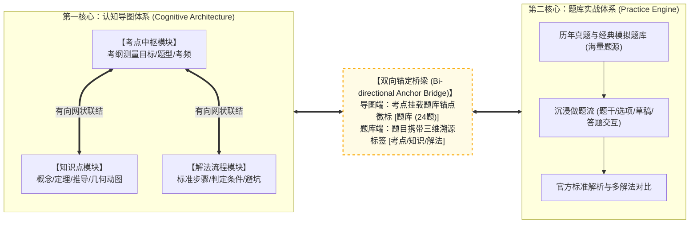
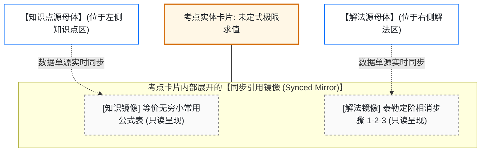
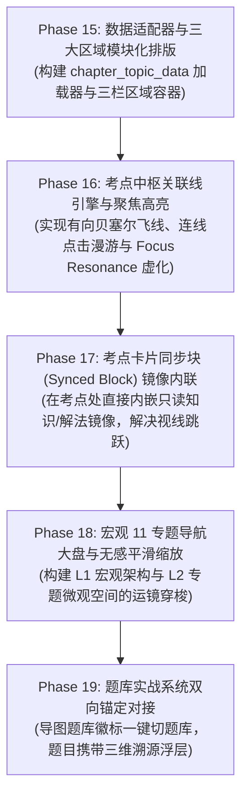

# 考研数学体系终极顶层设计与架构方案规范书 (Master Architecture Specification)

## 1. 系统总体定位与双核解耦架构

### 1.0 最高总则：根目录单一入口原则 (Single Entry Point)
全系统**最终只允许存在根目录下的 `index.html` 一个入口**。彻底废弃历史上的分散页面（如 `mindmap-sandbox/index.html`、`exam_workbench.html`、`最终笔记/index.html`）。四大系统（题库系统、知识点笔记系统、考点系统、解法系统）全部集成在根目录 `index.html` 的统一单页应用 (SPA) 架构中，通过顶层模式无感切换或画板空间漫游调度，共享快捷键体系、主题配置与本地同步存储。

本系统服务于考研数学的完整学习与应试闭环，经过深度推演，确立**“双核解耦、双向锚定”**的顶层架构模式：



### 1.1 为什么题库必须与认知三维解耦对立？
1. **数据容量的不对等性**：一个核心考点（如“0/0型极限求值”）在近 18 年中往往关联了 30~50 道真题及衍生习题。如果将数十道题目的题干、选项全部平铺在思维导图画布上，会导致导图信息过载崩溃、视觉混乱无法阅读；
2. **交互场景的本质差异**：
   * **导图体系（知识点+考点+解法）**：解决的是**“建立脑内知识图谱、梳理解题思路、理解几何直观”**的心流，追求全局感、结构感；
   * **题库体系（做题与测验）**：解决的是**“实战演练、抗压做题、错题归因”**的训练，追求专注、排版清晰与交互反馈；
3. **两者的有机联通方式**：
   * **从导图到题库**：考点节点仅挂载一个极简的**【题库锚点 Badge】**（显示题数，点击一键跳转至题库该考点练习流）；
   * **从题库到导图**：题库每道题目上方展示对应的**【溯源标签条】**（考点：未定式求值 | 解法：泰勒展开法），点击可呼出轻量弹窗查看该知识点或解法的完整大纲。

---

## 2. 认知导图体系（知识点、考点、解法）空间组织模型

### 2.1 区域模块化布局与连线漫游
在每个大专题（如高数第一章“函数、极限与连续”）的微观画布中，三类节点并不混乱交织，而是分为清晰的**三大功能区域（Regional Modules）**：

```
┌────────────────────────────────────────────────────────────────────────────────┐
│  专题微观空间：第一章 函数、极限与连续                                            │
│                                                                                │
│   ┌─────────────────────┐    ┌─────────────────────┐    ┌───────────────────┐  │
│   │   【知识点区域】    │    │    【考点中枢区域】 │    │   【解法流程区域】│  │
│   │  (Knowledge Block)  │    │   (Exam Point Hub)  │    │  (Method Block)   │  │
│   │                     │    │                     │    │                   │  │
│   │  · 等价无穷小公式表 │<─────── 考点1: 未定式极限 ───────>· 解法1: 乘除替换 │  │
│   │  · 泰勒公式展开式   │<───────    求值 (高频必考) │───────>· 解法2: 泰勒相消 │  │
│   │  · 两个重要极限定理 │    │       [题库 32题 ->]│    │  · 解法3: 洛必达  │  │
│   │    (内联几何动图)   │    │                     │    │                   │  │
│   │                     │    │ 考点2: 极限反求参数 ───────>· 解法4: 展开定参数│  │
│   │  · 导数定义与连续性 │<───────    (克制/送分题) │    │                   │  │
│   │                     │    │       [题库 6题 ->] │    │                   │  │
│   └─────────────────────┘    └─────────────────────┘    └───────────────────┘  │
│                                                                                │
└────────────────────────────────────────────────────────────────────────────────┘
```

* **中央考点中枢区（Exam Point Hub）**：位于视觉中心，按题型与考频从上至下列出该章核心考点；
* **左侧知识点区（Knowledge Block）**：提供坚实的理论底座，内部依然保持树形大纲折叠结构，内嵌公式推导与几何可视化小部件；
* **右侧解法流程区（Method Block）**：提供模块化的解题步骤流程、触发条件与避坑准则；
* **跨区域关联飞线（Smart Bézier Connectors）**：
  * 从考点卡片引出平滑的有向彩色连线，向左连接所依赖的知识点，向右连接所采用的解法；
  * 点击任意连线，镜头以平滑过渡动画（Pan & Zoom）漫游至另一侧对应的模块，彻底消除视口跳跃。

---

### 2.2 飞书“同步块 (Synced Block)”引用镜像机制

针对“频繁跨区域看线依然有视线移动”的痛点，引入飞书协同文档经典的**“同步块引用镜像（Synced Block Mirror）”**交互：



* **核心逻辑**：
  * 在中央考点卡片内部，点击展开图标，直接原地内嵌渲染它所关联的知识点公式与解法步骤的**“镜像副本（Read-only Mirror）”**；
  * 知识和解法的“源文件”依然规整存放在左右两侧各自的模块中，单源维护、实时同步；
  * 学生在考点处即可**原地一览其支撑理论与解法，视线完全无需左右跳跃**，达成极致“无感”的高效复习。

---

## 3. 底层数据契约规范 (Data Schema Specifications)

为确保后续对话无缝执行，定义标准的前后端交互数据协议：

### 3.1 专题认知导图数据契约 (`chapter_topic_data.json`)
```json
{
  "chapterId": "GS01",
  "title": "函数、极限与连续",
  "subject": "高等数学",
  "modules": {
    "knowledge": [
      {
        "id": "K_GS01_01",
        "title": "常用等价无穷小代换表",
        "contentMarkdown": "当 $x \\to 0$ 时：\n- $\\sin x \\sim x$\n- $1 - \\cos x \\sim \\frac{1}{2}x^2$\n- $e^x - 1 \\sim x$",
        "hasWidget": false
      },
      {
        "id": "K_GS01_02",
        "title": "麦克劳林展开式取主部",
        "contentMarkdown": "常用展开：$\\cos x = 1 - \\frac{x^2}{2} + \\frac{x^4}{24} + o(x^4)$",
        "hasWidget": true,
        "widgetType": "taylor_approximation"
      }
    ],
    "examPoints": [
      {
        "id": "KP_GS01_01",
        "title": "0/0 型未定式极限求值",
        "importance": 5,
        "trend": "上升",
        "questionCount": 32,
        "questionRefIds": ["2024_math1_01", "2023_math3_15"],
        "linkedKnowledgeIds": ["K_GS01_01", "K_GS01_02"],
        "linkedMethodIds": ["M_GS01_01", "M_GS01_02"]
      }
    ],
    "methods": [
      {
        "id": "M_GS01_01",
        "title": "乘除因子局部等价代换法",
        "coreOneLiner": "乘除因子放心换，加减位置一相消就退泰勒",
        "steps": [
          "步骤1：识别分子分母中的乘除因子",
          "步骤2：应用主部公式直接代换",
          "步骤3：检测加减主部是否抵消（若抵消自动降级至 M_GS01_02）"
        ],
        "pitfalls": "加减结构中切勿直接替换部分项"
      }
    ]
  },
  "associativeLines": [
    {
      "id": "line_01",
      "from": "KP_GS01_01",
      "to": "K_GS01_01",
      "type": "theory_support",
      "label": "理论支撑"
    },
    {
      "id": "line_02",
      "from": "KP_GS01_01",
      "to": "M_GS01_01",
      "type": "solution_flow",
      "label": "首选解法"
    }
  ]
}
```

### 3.2 题库真题挂载元数据契约 (`question_item_data.json`)
```json
{
  "id": "2024_math1_01",
  "year": 2024,
  "paper": "数学一",
  "qNumber": 1,
  "type": "choice",
  "score": 5,
  "stem": "极限 $\\lim_{x \\to 0} \\frac{\\cos x - e^{-\\frac{x^2}{2}}}{x^4} = (\\quad)$",
  "options": ["A. -1/12", "B. 1/12", "C. -1/6", "D. 1/6"],
  "answer": "A",
  "analysis": "利用麦克劳林展开到 $x^4$ 项，分子相消定阶...",
  "tracingMeta": {
    "chapterId": "GS01",
    "kpId": "KP_GS01_01",
    "methodId": "M_GS01_02"
  }
}
```

---

## 4. 后续对话执行实施路线图 (Phase 15 ~ Phase 19)

为保证其他对话在接手本任务时拥有清晰的施工图纸，制定原子化分阶段实施路线：



### 阶段执行目标与验收标准 (DoD)

1. **Phase 15：数据适配器与三区域模块化排版**
   * **目标**：在 `mindmap-sandbox` 中实现 `ChapterTopicLoader`，将同一专题渲染为左【知识点】、中【考点】、右【解法】的清爽模块布局。
   * **验收**：通过 CDP 自动化测试验证三区域盒模型尺寸与节点加载。
2. **Phase 16：考点中枢关联线引擎与聚焦高亮**
   * **目标**：基于现有 `simple-mind-map` 或 SVG 连线层，绘制考点连接知识点与解法的平滑曲线；点击考点触发聚焦高亮（其他节点透明度置为 0.15）。
   * **验收**：自动化测试验证关联线绘制、点击连线视口平滑居中。
3. **Phase 17：考点卡片同步块（Synced Block）镜像内联**
   * **目标**：在考点实体卡片上增加展开开关，原地内嵌对应知识点公式卡片与解法步骤列表，数据单源绑定。
   * **验收**：测试在不漫游移动视口的前提下，原地展开查看公式与解法。
4. **Phase 18：宏观 11 专题大盘与平滑缩放漫游**
   * **目标**：构建 L1 宏观总导图（高数 11 专题），点击任意专题以动画缩放推近至 L2 专题三维画布；顶部提供面包屑与上一章/下一章切换。
   * **验收**：测试宏观与微观视角的全键盘与鼠标漫游无卡顿、无跳帧。
5. **Phase 19：题库实战系统双向锚定对接**
   * **目标**：考点上挂载真实题数徽标，点击打开沉浸做题流；题库做题界面上方显示知识/解法溯源按钮，点击弹层反向定位。
   * **验收**：完整走通“导图看考点 $\rightarrow$ 点击做题 $\rightarrow$ 做题遇阻查解法”的完整教学闭环。

---

## 5. 多对话分工接力流水线规范 (Multi-Session Execution Specifications)

为确保工程落地不因单次对话长度受限而中断，特确立清晰的三会话分工与任务交接协议：

### 5.1 对话一任务书：根目录题库系统现代化重构与接口预留专项
* **执行主体**：下一个对话（Conversation 1）
* **核心使命**：对当前根目录 `index.html` 承载的题库系统进行界面、交互、响应式、性能、全键盘和代码架构的全面现代化升级，使其具备飞书级高品质，并为四大系统集成预留标准的通信接口。
* **主要修改文件**：`index.html`、`css/styles.css`、`js/app.js`、`js/chapters.js` 等。
* **必须完成的核心优化**：
  1. **侧栏与标题栏现代化**：精简左侧边栏，重构章节筛选下拉为现代化面包屑卡片；移除已废弃的 `exam_workbench.html` 外链；
  2. **做题流体验优化**：优化题目富文本与 KaTeX 排版防抖动，平滑折叠展开解析，强化全键盘操作（`J/K` 上下题、`1/2/3` 快速标记状态、`Space` 展开解析）；
  3. **预留四维认知挂载插槽 (Cognitive Nexus Slot)**：在题目卡片标题栏预留考点与解法标签渲染区，派发 `open-cognitive-view` 全局自定义事件，供后续导图系统联动；
  4. **回归测试保障**：跑通 `node tests/cdp_e2e_tests.js` 确保 100% 现有题库功能不受破坏。

### 5.2 对话二任务书：第一章核心技术前沿研发专项 (以最终笔记为载体)
* **执行主体**：下下一个对话（Conversation 2）
* **核心使命**：使用 `题库/最终笔记/data/第1章_函数与极限.md` 作为真实业务试验田，将所需的全部前沿呈现技术完整研发并跑通。
* **主要输入文件**：`最终笔记/data/第1章_函数与极限.md`、`题库/研砖/pojue_lectures.json` (GS01 招法)、`题库/研砖/kaogang_figures.json` (极限动图)。
* **必须攻克的核心技术栈**：
  1. **飞书画板式无限画布与三大区域模块化排版**：左【知识点】、中【考点】、右【解法】；
  2. **考点中枢有向贝塞尔关联线与 Focus Resonance 聚焦高亮**：打破纯树状限制，呈现有向图；
  3. **飞书“同步块 (Synced Block)”引用镜像内联**：考点卡片原地内嵌展开知识定理与解法步骤；
  4. **参数化数学几何动图小部件 (MathViz Widget)**：超轻量 2D/3D 动图直接嵌入知识点大纲；
  5. **自动化测试套件**：编写 `tests/test_chapter1_prototype.js` 验证全部交互。

### 5.3 后续对话任务预告：全量数据工程与根 `index.html` 终极会师
* **执行主体**：后续对话（Conversation 3+）
* **核心使命**：在对话一（题库现代化）与对话二（第一章技术栈成熟）的基础上，对全量 11 专题数据进行自动化切片与编译，将三维画板组件与题库系统在根目录唯一的 `index.html` 中完成终极合体！

