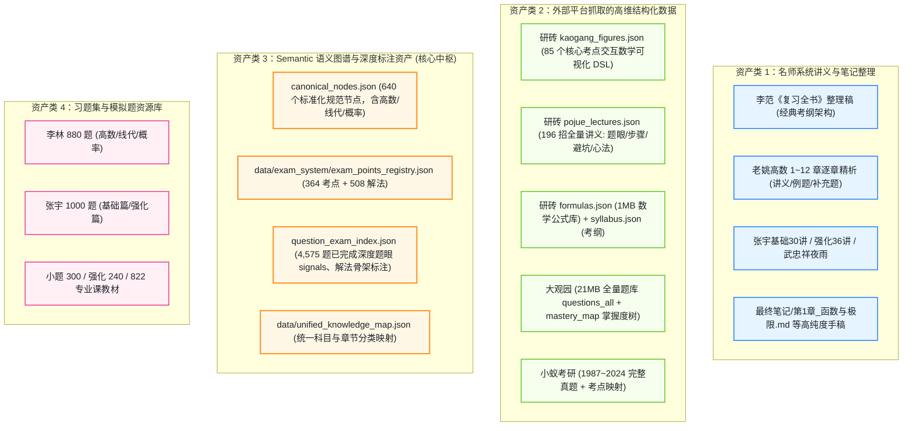
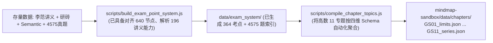

# 考研数学现有存量资源综合利用与工程管道方案规划

## 1. 现有资源全景盘点：我们究竟坐拥怎样的资源资产？

经深入探查，当前工作区中并非零散琐碎的文件，而是已经积累了**极高纯度、极深标注、且涵盖全链条的四大类核心资产库**：



---

## 2. 综合利用法则：“各归其位”的四维管道映射

面对如此庞大的数据，绝对不能胡子眉毛一把抓，必须让每一类资源**流入它最擅长、信息纯度最高的维度**：

```
[源数据资源]                                              [四维认知与实战系统]
┌───────────────────────────────────────┐
│ 1. 名师讲义/教材 (李范/老姚/张宇/手稿) │ ───────────────> 【1. 知识点系统】(概念定义/定理推导)
│ 2. 研砖 figures (85考点可视化DSL)     │ ───────────────>  └─ 内联: 交互几何函数动图 (MathViz)
└───────────────────────────────────────┘

┌───────────────────────────────────────┐
│ 3. Semantic 规范节点 (640 节点)       │ ───────────────> 【2. 考点系统】(更高维统摄中枢)
│ 4. exam_points_registry (364 考点)    │ ───────────────>  └─ 承接考纲、考频、分值要求
└───────────────────────────────────────┘

┌───────────────────────────────────────┐
│ 5. 研砖破题诀讲义 (196招结构化 Markdown)│ ───────────────> 【3. 解法系统】(解题步骤与战术)
│ 6. Semantic 508 解法方法库            │ ───────────────>  └─ 呈现: 题眼信号/心法/避坑准则
└───────────────────────────────────────┘

┌───────────────────────────────────────┐
│ 7. question_exam_index (4,575 题标注)  │ ───────────────> 【4. 题库系统】(实战检验池)
│ 8. 880 / 1000 / 大观园全量题池         │ ───────────────>  └─ 呈现: 题面选项交互/做题溯源
└───────────────────────────────────────┘
```

---

## 3. 四大维度的具体加工与提纯方案

### 3.1 知识点系统：以“李范/老姚框架”为骨架，融入“研砖可视化动图”
* **骨架母体**：直接采用已有整理好的 `00_总目录_笔记主线_李范框架.md` 和 `老姚高数` 12 章体系，这是考研界公认最严谨的知识点树状目录。
* **内容提纯**：
  * 从已有的 Markdown 手稿（如 `最终笔记/data/第1章_函数与极限.md`）提取严谨的定理叙述、前置条件与 LaTeX 公式；
  * **杀手级融合**：读取 `题库/研砖/kaogang_figures.json`，通过考点名称对齐，将 85 个交互式 3D/2D 图形 DSL 直接作为小部件内嵌到对应定理下方（例如：多元极值下方内嵌鞍点三维曲面，导数几何意义下方内嵌动态割线切线）；
* **产出成果**：一本结构整洁、全公式 LaTeX 化、关键概念自带动态交互图形的“新一代知识大纲”。

---

### 3.2 考点系统：以“Semantic 规范节点”为高维统摄中枢
* **核心中枢**：直接复用 `data/exam_system/exam_points_registry.json` 中已经整理好的 364 个规范考点。
* **为什么它是核心胶水？**
  * 在这个文件中，每个考点（如 `EP.CALC.LIMIT_01`）不仅有规范名称，还包含了：
    * `linked_knowledge_ids`: 关联哪些知识点 ID；
    * `recommended_methods`: 关联哪些解法 ID；
    * `evidence_question_count`: 命中多少道真题；
  * **利用方式**：考点系统无需编写任何大段文字，它负责在专题导图中生成居中的【考点卡片】，并作为“路由中枢”，向左拉线给知识点，向右拉线给解法，末端挂载真题数。

---

### 3.3 解法系统：以“研砖 196 招 + Semantic 508 方法”为核心
* **数据源**：`题库/研砖/pojue_lectures.json` 与 `data/exam_system/exam_points_registry.json` 中的 `methods` 表。
* **加工逻辑**（我们已有解析脚本 `scripts/build_exam_point_system.js`）：
  * 自动将每篇讲义正则切割为四个规范字段：
    1. **题眼信号（什么时候用）**：提炼题干特征词；
    2. **标准步骤（怎么做）**：结构化为 `[步骤1, 步骤2, 步骤3]`；
    3. **一句话心法（核心准则）**：提炼最管用的解题口诀；
    4. **避坑边界（注意事项）**：易错点与反例。
* **产出成果**：当学生点击某个考点延伸出的解法时，直观呈现标准解题流，绝不冗余。

---

### 3.4 题库系统：以“4,575 题深度语义标注真题”为第一核心梯队
* **第一梯队（带题眼与解法的真题核心池）**：
  * 工作区内的 `question_exam_index.json`（4,575 题）是无价之宝！
  * 这 4,575 题不仅有题干和解析，**而且每道题都已经完成了深度语义标注**：
    * `signals`: 标注了题目中给出的信号词（如“识别为复合函数形式，考虑等价无穷小代换”）；
    * `method_ids`: 标注了本题使用了什么方法；
    * `solution_skeleton`: 标注了本题的标准解题骨架。
  * **利用方式**：这 4,575 题直接作为每个考点下的“真题实战演练集”！
* **第二梯队（海量扩充题池）**：
  * 李林 880、张宇 1000 题、大观园题库作为二级扩展题源，按章节挂载，供学生刷完真题后专项拔高。

---

## 4. 实施工具链与自动化流水线建议 (Tooling Pipeline)

整个资源的整合**完全不需要人工复制粘贴**，工作区中现有的自动化脚本已经跑通了大半：



1. **现有脚本复用**：`scripts/build_exam_point_system.js` 已经将 Semantic 节点、研砖讲义与 4575 题完成了初步聚合，生成了 `data/exam_system/` 下的 3 个大文件（共计约 14MB）；
2. **轻量切片脚本**：只需编写一个极简聚合脚本（如 `compile_chapter_topics.js`），按照我们上一轮制定的 `chapter_topic_data.json` 规范，把庞大的总索引按高数 11 个专题切片输出为 `GS01.json` ~ `GS11.json`；
3. **前端零负担加载**：前端思维导图沙箱每次只按需加载当前专题的轻量 JSON（约 50KB~100KB），即可完美呈现知识、考点、解法与对应题目的全貌！

这套方案把您硬盘里积累的所有高价值资产全部盘活，各司其职，没有一行数据被浪费。
